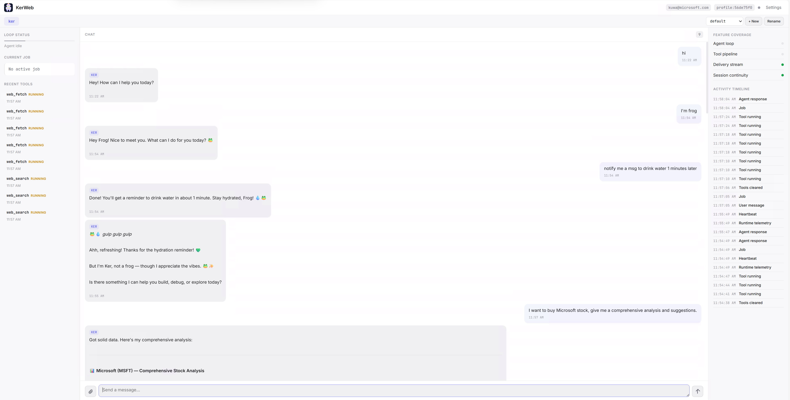
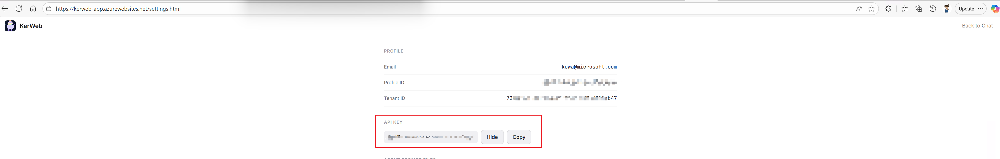

# Ker

CLI-first, extensible agent runtime with a full agent stack: loop, tools, sessions, memory, multi-agent routing, cron/heartbeat, and multi-provider LLM support.



## Features

- Async agent loop with tool-use chaining (max 120 iterations) and automatic context compaction.
- 18 built-in tools: `exec`, `bash`, `read_file`, `write_file`, `edit_file`, `list_dir`, `skill`, `read_memory`, `write_memory`, `web_search`, `web_fetch`, `cron`, `message`, `spawn`, `capture_agent_conversation`, `self_evolve`, `long_task`, plus dynamic MCP tools.
- JSONL session persistence with adaptive context compaction on overflow.
- Channel abstraction: CLI, KerWeb WebSocket, KerWeb HTTP polling.
- Multi-agent system: auto-discovered from `.ker/agents/`, per-agent model/token/tool overrides.
- Layered system prompt: IDENTITY, SOUL, USER, TOOLS, AGENTS, BOOT templates (session-type aware).
- Two-tier memory: long-term (MEMORY.md with dedup) and short-term search (daily logs, chat history, session).
- Skills system: discoverable SKILL.md files with frontmatter, requirements, auto-load support.
- Cron scheduler (every/cron/at) and heartbeat runner with smart execution.
- Daily self-evolution cycle: reads errors + memory, conservatively edits agent config.
- Long-running task orchestration via Claude CLI subprocess.
- Subagent manager for background task spawning.
- LLM providers: Anthropic (Claude), GitHub Copilot (OAuth + chat/completions + responses endpoints).
- MCP integration for dynamic tool registration from external servers.

## Quick Start

### 1. Prerequisites

- Python 3.11+
- [`uv`](https://docs.astral.sh/uv/) (recommended) or any compatible Python environment manager.

### 2. Install Dependencies

```bash
uv sync
```

### 3. Configure LLM Provider

Create a `.env` file in the project root. Choose one of the providers below:

#### GitHub Copilot (recommended)

No API key needed — uses your GitHub account with Copilot subscription.

```env
LLM_PROVIDER=github_copilot
MODEL_ID=gpt-5.3-codex
```

Then authenticate (one-time):

```bash
uv run ker github_copilot login
```

This runs the GitHub OAuth device flow — it prints a URL and code, you authorize in your browser, and the token is saved to `.ker/config.json`. If you skip this step, the device flow triggers automatically on the first API call.

Available models: `gpt-4o`, `gpt-5.3-codex`, `claude-sonnet-4`, `o4-mini`, and any model supported by GitHub Copilot. Codex models use the `/responses` endpoint; all others use `/chat/completions`.

#### Anthropic (Claude)

```env
LLM_PROVIDER=anthropic
MODEL_ID=claude-opus-4-6
ANTHROPIC_API_KEY=sk-ant-...
```

Get your API key at [console.anthropic.com](https://console.anthropic.com/) → API Keys → Create Key.

#### KerWeb (optional)

Add this to `.env` if you want to connect Ker to the KerWeb frontend:

```env
KERWEB_API_KEY=...
```

Get the key at [kerweb-app.azurewebsites.net](https://kerweb-app.azurewebsites.net/) → Settings → copy the API Key.



### 4. Start Ker

**CLI mode** (interactive terminal, default):

```bash
uv run ker
```

**Gateway mode** (all channels enabled, connects to KerWeb):

```bash
uv run ker gateway
```

Gateway mode auto-connects to KerWeb via WebSocket (falls back to HTTP polling) and enables cron, heartbeat, and all background services.

Type `/help` once running to see available commands.

## Start Commands

| Command | Description |
|---|---|
| `uv run ker` | CLI mode (stdin/stdout, default) |
| `uv run ker cli` | Explicit CLI mode |
| `uv run ker gateway` | Full gateway with all channels (KerWeb, cron, heartbeat) |
| `uv run ker github_copilot login` | GitHub Copilot OAuth login |

Without `uv`:

```bash
python -m ker.main             # CLI mode
python -m ker.main gateway     # Gateway mode
```

Background (Windows PowerShell):

```powershell
Start-Process -NoNewWindow -FilePath .venv\Scripts\python.exe `
  -ArgumentList '-m', 'ker.main', 'gateway'
```

## Configuration

Settings are loaded from: `.ker/config.json` → `.env` → defaults.

| Variable | Default | Description |
|---|---|---|
| `LLM_PROVIDER` | `anthropic` | LLM provider: `anthropic`, `azure`, `github_copilot` |
| `MODEL_ID` | `claude-opus-4-6` | Model identifier |
| `ANTHROPIC_API_KEY` | *(empty)* | Anthropic API key |
| `GITHUB_COPILOT_TOKEN` | *(empty)* | GitHub Copilot access token (optional, skips OAuth) |
| `MAX_TOKENS` | `8096` | Max output tokens per LLM call |
| `KERWEB_ENABLED` | `1` | Enable KerWeb channel |
| `KERWEB_API_KEY` | *(empty)* | KerWeb API key |
| `KERWEB_BASE_URL` | `https://kerweb-app.azurewebsites.net` | KerWeb backend URL |
| `KERWEB_POLL_INTERVAL_SEC` | `1.0` | HTTP polling interval (seconds) |
| `HEARTBEAT_ENABLED` | `1` | Enable heartbeat runner |
| `CRON_ENABLED` | `1` | Enable cron scheduler |
| `DELIVERY_ENABLED` | `0` | Enable write-ahead delivery queue |
| `AZURE_OPENAI_KEY` | *(empty)* | Azure OpenAI API key |
| `AZURE_OPENAI_ENDPOINT` | *(empty)* | Azure OpenAI endpoint URL |
| `LOG_RETENTION_DAYS` | `30` | Days to retain log files |
| `MEMORY_CONSOLIDATION_WINDOW` | `50` | Memory consolidation window |

### Per-Agent Configuration

Each agent can override settings via `.ker/agents/{name}/config.json`:

```json
{
  "enabled": true,
  "model_id": "claude-opus-4-6",
  "max_tokens": 8096,
  "tools": ["read_file", "write_file", "exec"],
  "skills": ["claude", "github"]
}
```

### MCP Servers

External MCP servers can be configured in `.ker/config.json`:

```json
{
  "mcp_servers": {
    "my-server": {
      "command": "npx",
      "args": ["-y", "my-mcp-server"],
      "env": {}
    }
  }
}
```

MCP tools are registered dynamically at startup with names prefixed `mcp_{server}_{tool}`.

## Tools

| Tool | Description |
|---|---|
| `exec` | Execute a shell command with safety guard (blocks `rm -rf`, `shutdown`, etc.) |
| `bash` | Alias for `exec` with shorter default timeout |
| `read_file` | Read file contents from workspace |
| `write_file` | Write/create a file under workspace |
| `edit_file` | Replace exact substring in a file |
| `list_dir` | List directory contents |
| `skill` | Manage skills: `list`, `show`, `read`, `install` |
| `read_memory` | Search short-term memory (daily logs, chat history, session) |
| `write_memory` | Save/remove facts in long-term memory (MEMORY.md) |
| `web_search` | Search the web via Brave API |
| `web_fetch` | Fetch URL and extract readable content (HTML → Markdown) |
| `cron` | Manage scheduled jobs: `add`, `list`, `remove` |
| `message` | Send a direct message to a channel peer |
| `spawn` | Spawn a background subagent task |
| `capture_agent_conversation` | Watch and record an external agent session (Claude/Codex) |
| `self_evolve` | Self-evolution: `status`, `history`, `trigger`, `config` |
| `long_task` | Run a long-running task via Claude CLI: `start`, `status`, `cancel`, `list` |

## Architecture

```
Gateway
├── Channels (CLI, KerWeb WS, KerWeb HTTP)
├── Agent Loop (model + tool chaining, max 120 iterations)
├── Tool Registry (18 built-in + dynamic MCP tools)
├── Session Store (JSONL persistence per agent/session)
├── Context Guard (overflow detection, compaction, truncation)
├── Memory Store (long-term MEMORY.md + short-term daily/chat/session)
├── Prompt Builder (layered bootstrap: IDENTITY → SOUL → USER → TOOLS → AGENTS → BOOT)
├── Skills Manager (discoverable SKILL.md files with frontmatter)
├── Cron Scheduler (every/cron/at schedules, croniter-based)
├── Heartbeat Runner (periodic tasks from HEARTBEAT.md)
├── Subagent Manager (background task spawning)
└── LLM Provider (Anthropic / GitHub Copilot)
```

| Module | Purpose |
|---|---|
| `agent/` | Agent loop, config, context management (memory, session, prompt, skills, context guard) |
| `channels/` | Channel abstraction: CLI, KerWeb WebSocket, KerWeb HTTP polling |
| `gateway/` | Central orchestrator, command dispatch, agent discovery, background services |
| `tools/` | Tool schemas, registry, dispatch, handlers |
| `llm/` | LLM provider abstraction and factory |
| `scheduler/` | Cron service and heartbeat runner |
| `memory/` | Bootstrap templates (IDENTITY, SOUL, USER, TOOLS, AGENTS, BOOT) |
| `skills/` | Built-in skill definitions |

## Runtime State

All runtime state is stored in project-local `.ker/`:

```
.ker/
├── config.json                # Settings overrides + GitHub Copilot token
├── MEMORY.md                  # Long-term memory (facts by category)
├── agents/
│   └── {name}/
│       ├── AGENT.md           # Agent identity/instructions
│       ├── IDENTITY.md        # Personality override (optional)
│       ├── config.json        # Per-agent settings
│       ├── session/           # Session JSONL files
│       │   └── {channel}_{user}_{session}.jsonl
│       ├── chatHistory/
│       │   └── chatHistory.jsonl
│       └── skills/            # Agent-specific skills
│           └── {name}/SKILL.md
├── memory/
│   ├── daily/                 # Daily logs ({YYYY-MM-DD}.jsonl)
│   ├── evolution/             # Self-evolution config + log
│   └── ERROR_LOG.jsonl        # Runtime errors with context
├── cron/
│   └── jobs.json              # Scheduled jobs
├── templates/
│   └── HEARTBEAT.md           # Periodic task list
├── cache/
│   └── github_copilot/        # Short-lived API key cache
├── media/                     # Uploaded images
└── logs/                      # Daily log files ({YYYY-MM-DD}.log)
```

Bootstrap templates ship with Ker and load automatically. Override by placing files in `.ker/agents/{name}/` or `.ker/templates/`.

## CLI Commands

| Command | Description |
|---|---|
| `/help` | Show available commands |
| `/exit` | Terminate Ker |
| `/agents` | List discovered agents |
| `/switch-agent <name\|off>` | Override agent routing |
| `/sessions` | Show current session |
| `/new <name>` | Create and switch to a new session |
| `/switch <name>` | Switch to an existing session |
| `/rename <name>` | Rename the current session |
| `/context` | Show estimated context token usage |
| `/compact` | Compact session history |
| `/prompt` | Show the full system prompt |
| `/skills` | Show skills summary |
| `/search <query>` | Search memory |
| `/heartbeat` | Show heartbeat status |
| `/trigger` | Queue manual heartbeat execution |
| `/cron` | List all cron jobs |
| `/cron-run <job_id>` | Execute a cron job immediately |

## Tests

```bash
uv run pytest -q
```

Fallback without `uv`:

```bash
python -m pytest -q
```

## Extending Channels

Implement `ker.channels.base.AsyncChannel` and register it in runtime setup. The agent core consumes normalized `InboundMessage`, so new channels do not require loop changes.
